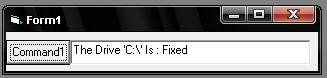



## Drive type viewer

### Description

To retrive a drive type by just giving it's letter ex: "C:\"
 
### More Info
 

             |
---                |---
**Submitted On**   |2008-03-10 13:49:12
**By**             |[Ratul Ahmed](https://github.com/Planet-Source-Code/PSCIndex/blob/master/ByAuthor/ratul-ahmed.md)
**Level**          |Intermediate
**User Rating**    |5.0 (10 globes from 2 users)
**Compatibility**  |VB 6\.0
**Category**       |[Windows System Services](https://github.com/Planet-Source-Code/PSCIndex/blob/master/ByCategory/windows-system-services__1-35.md)
**World**          |[Visual Basic](https://github.com/Planet-Source-Code/PSCIndex/blob/master/ByWorld/visual-basic.md)
**Archive File**   |[Drive\_type21314210212008\.zip](https://github.com/Planet-Source-Code/ratul-ahmed-drive-type-viewer__1-71271/archive/master.zip)

